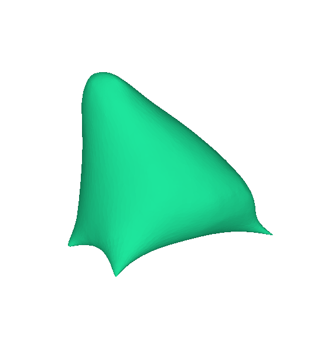
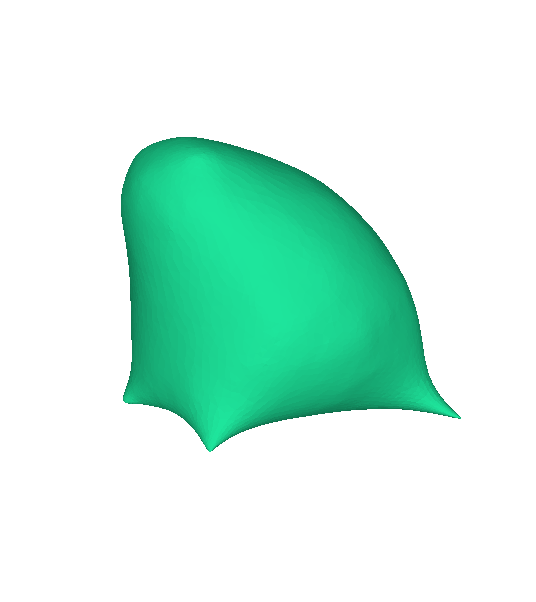
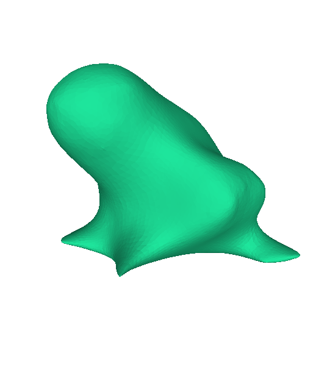
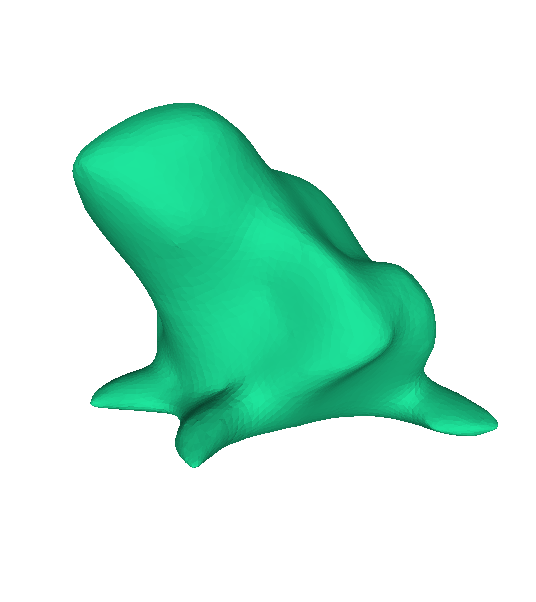
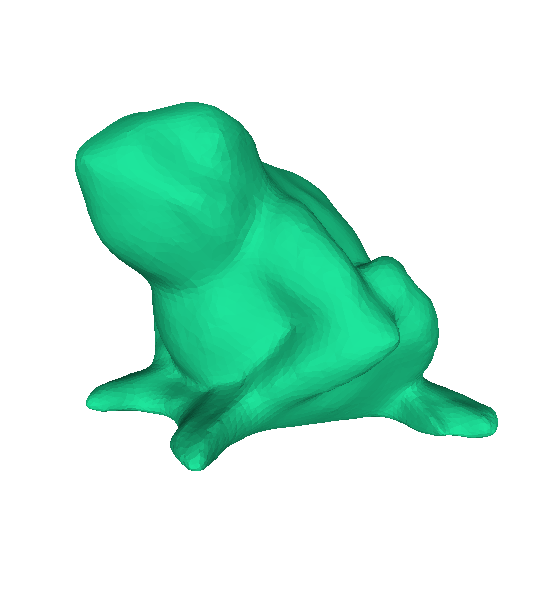
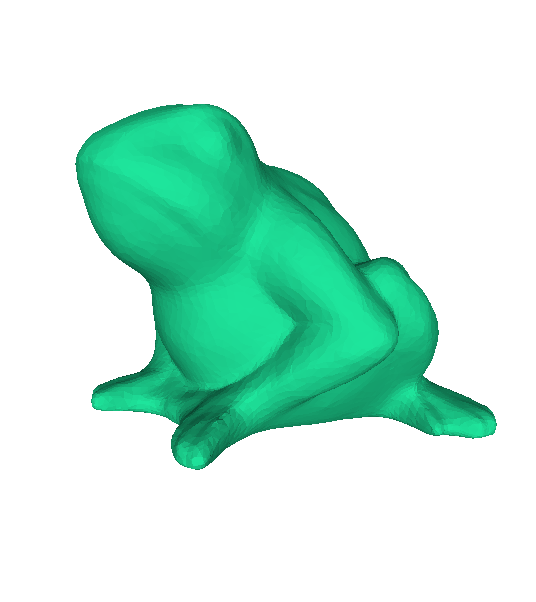

# Spectral Mesh Transform
"Spectral compression of mesh geometry, 2000" [[Paper]](https://dl.acm.org/doi/10.1145/344779.344924) を実装。

メッシュ上でのフーリエ変換を定義し、メッシュ上の信号（ex. 頂点座標）を周波数成分に分解する。

## ライブラリ
```
numpy
scipy
torch
```

## デモ

```
python main.py
```

<table>
  <tr>
    <td width="33%"></td>
    <td width="33%"></td>
    <td width="33%"></td>
  </tr>
  <tr>
    <td align="center" width="33%">k=5</td>
    <td align="center" width="33%">k=10</td>
    <td align="center" width="33%">k=50</td>
  </tr>
  <tr>
    <td width="33%"></td>
    <td width="33%"></td>
    <td width="33%"></td>
  </tr>
  <tr>
    <td align="center" width="33%">k=100</td>
    <td align="center" width="33%">k=500</td>
    <td align="center" width="33%">original</td>
  </tr>
</table>

入力メッシュは9555頂点からなるが、500個の低周波成分だけで概形を復元することができる。